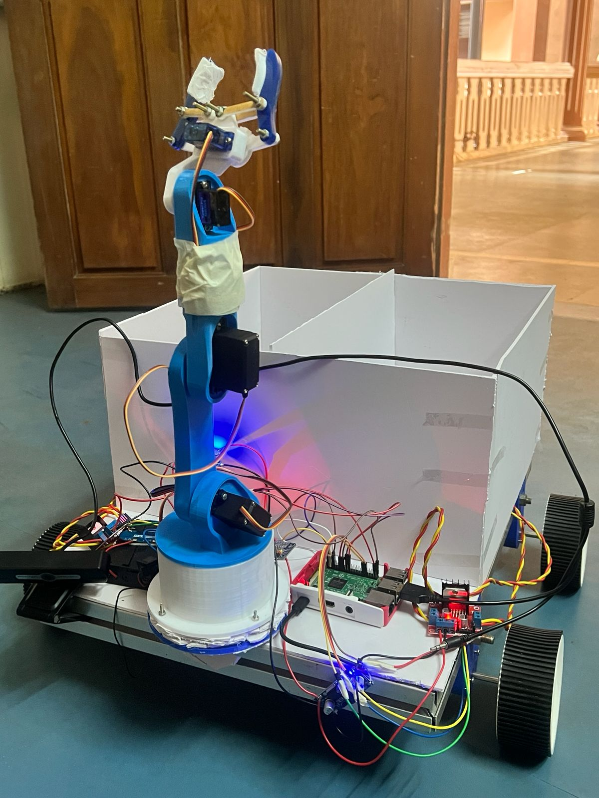
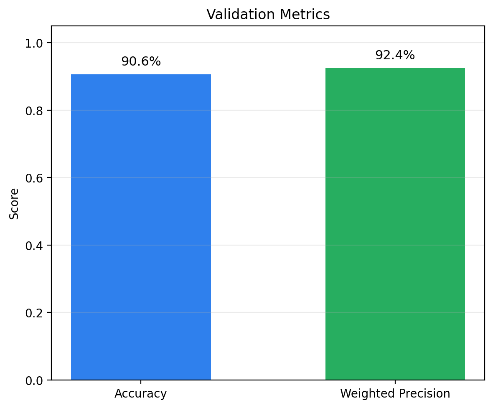
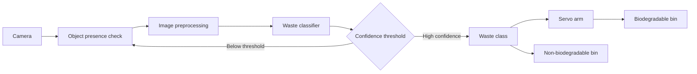
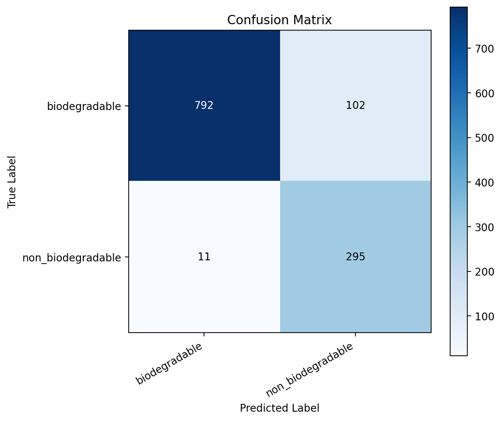

# Vision-Guided Autonomous Waste Segregation and Collection Robot

> A computer-vision waste classification system that combines a trained MobileNetV2 classifier, real-time camera inference, Raspberry Pi deployment, and a servo-driven sorting mechanism.

<p align="center">
    
</p>

<p align="center">
    
</p>

<p align="center">
  <a href="#results"></a>
  <a href="#project-structure"></a>
  <a href="#license"></a>
</p>

## Overview

This project classifies waste into **biodegradable** and **non-biodegradable** categories and can pass the prediction to a servo-controlled sorting mechanism. The same trained model is available in Keras format for development and TensorFlow Lite format for lightweight deployment.

### System flow



## Results

Evaluation on the included validation report (1,200 images):

| Metric | Score |
|---|---:|
| Accuracy | **90.58%** |
| Weighted precision | **92.43%** |
| Biodegradable F1 | 93.34% |
| Non-biodegradable F1 | 83.93% |

<details>
<summary><strong>View class-wise metrics</strong></summary>

| Class | Precision | Recall | F1 | Support |
|---|---:|---:|---:|---:|
| Biodegradable | 98.63% | 88.59% | 93.34% | 894 |
| Non-biodegradable | 74.31% | 96.41% | 83.93% | 306 |

</details>

### Confusion matrix

<p align="center">
  
</p>

The current model is substantially better at recall for non-biodegradable waste than at precision for that class. This is worth considering when tuning the confidence threshold for physical sorting.

## Features

- Transfer learning with **MobileNetV2 + ImageNet weights**.
- Data augmentation using random flip, rotation, zoom, and contrast.
- Class weighting to reduce the effect of class imbalance.
- Early stopping, model checkpointing, and learning-rate reduction.
- Keras model for desktop development and evaluation.
- TensorFlow Lite model for Raspberry Pi inference.
- Webcam and Pi Camera Module / USB camera support.
- Optional dry-run mode for testing servo logic without GPIO output.
- Automatic corrupt-image detection and optional relocation.

## Project structure

```text
Vision-Based-Waste-Sorting-Robot/
├── arm_control.py             # Servo control and pick/place sequences
├── robot_sorter.py            # TFLite classification + robotic sorting
├── webcam_test.py             # Desktop Keras webcam inference
├── cam.py                     # Camera availability test
├── train_model.py             # Training + fine-tuning
├── evaluate_model.py          # Validation metrics and plots
├── find_bad_images.py         # Detect corrupt dataset images
├── requirements.txt           # Desktop dependencies
├── models/
│   ├── waste_classifier.keras
│   ├── waste_classifier.tflite
│   └── class_names.json
├── pi/
│   ├── pi_tflite_camera.py    # Raspberry Pi TFLite inference
│   └── requirements-pi.txt    # Pi dependencies
├── reports/
│   ├── confusion_matrix.png
│   ├── metrics_summary.png
│   └── classification_report.txt
├── dataset/README.md          # Dataset layout; images are not committed
├── .gitignore
└── LICENSE
```

## Quick start

<details>
<summary><strong>1. Clone and create a virtual environment</strong></summary>

```bash
git clone <YOUR-REPOSITORY-URL>
cd Vision-Based-Waste-Sorting-Robot
python -m venv .venv
```

Windows PowerShell:

```powershell
.\.venv\Scripts\Activate.ps1
pip install -r requirements.txt
```

Linux/macOS:

```bash
source .venv/bin/activate
pip install -r requirements.txt
```

</details>

<details>
<summary><strong>2. Prepare the dataset</strong></summary>

The repository intentionally excludes the image dataset. Create:

```text
dataset/
├── train/
│   ├── biodegradable/
│   └── non_biodegradable/
└── val/
    ├── biodegradable/
    └── non_biodegradable/
```

Place the appropriate images in the class folders.

</details>

<details>
<summary><strong>3. Train the classifier</strong></summary>

```bash
python train_model.py
```

Default settings use 224×224 images, a batch size of 32, 10 feature-extraction epochs, and 3 fine-tuning epochs. The script saves:

- `models/waste_classifier.keras`
- `models/class_names.json`
- `models/training_history.json`

</details>

<details>
<summary><strong>4. Evaluate the model</strong></summary>

```bash
python evaluate_model.py
```

This reads the validation split and generates the report files under `reports/`.

</details>

<details>
<summary><strong>5. Test with a webcam</strong></summary>

```bash
python webcam_test.py
```

Useful options:

```bash
python webcam_test.py --camera 1 --lock-threshold 0.90 --lock-frames 3
```

Press **q** to quit and **r** to reset a locked prediction.

</details>

<details>
<summary><strong>6. Test the robot sorter safely</strong></summary>

The sorter supports a dry-run mode so you can test classification and arm decisions without driving GPIO servos:

```bash
python robot_sorter.py --dry-run --once
```

For actual hardware, calibrate the servo poses in `arm_control.py` before placing waste near the manipulator.

</details>

## Raspberry Pi deployment

The Pi script uses the TensorFlow Lite model and supports either a USB/V4L2 camera through OpenCV or a Pi Camera Module through `picamera2`.

From the repository root on the Pi:

```bash
pip install -r pi/requirements-pi.txt
python pi/pi_tflite_camera.py --source opencv
```

For a Pi Camera Module:

```bash
python pi/pi_tflite_camera.py --source picamera2
```

For a headless setup:

```bash
python pi/pi_tflite_camera.py --source picamera2 --headless
```

> **Note:** Raspberry Pi package availability varies by OS image and Python version. `picamera2` is normally installed through the Raspberry Pi OS package manager, and `tflite-runtime` must match the Pi's Python/architecture.

## Model files

| File | Purpose |
|---|---|
| `waste_classifier.keras` | Full Keras model for training/development |
| `waste_classifier.tflite` | Lightweight model for embedded inference |
| `class_names.json` | Maps output indices to waste classes |

## Safety and calibration

This repository contains code that can drive physical servos. Before connecting the arm:

1. Run the sorter in `--dry-run` mode.
2. Verify the predicted class and pick/drop sequence.
3. Calibrate the angles in `arm_control.py` with the arm unloaded.
4. Keep the emergency power disconnect accessible.
5. Start with slow movements and an empty workspace.

The pose values in the repository are project-specific starting points, **not universal servo calibration values**.

## Known limitations

- The classifier is binary: biodegradable vs non-biodegradable.
- The object-presence check is based on edge density and can be sensitive to lighting/backgrounds.
- A confidence threshold does not guarantee a correct physical classification.
- Servo angles require calibration for the actual mechanical assembly.
- The training dataset is not included in the repository.

## Future improvements

- Replace the heuristic object-presence detector with a dedicated object detector.
- Add temporal smoothing / multi-frame voting to the robot sorter.
- Add camera calibration and a fixed ROI.
- Log predictions and sorting events for later analysis.
- Add automated tests for preprocessing, model output mapping, and servo sequencing.
- Add a mechanical position/limit safety layer before autonomous operation.

## License

Released under the [MIT License](LICENSE).
